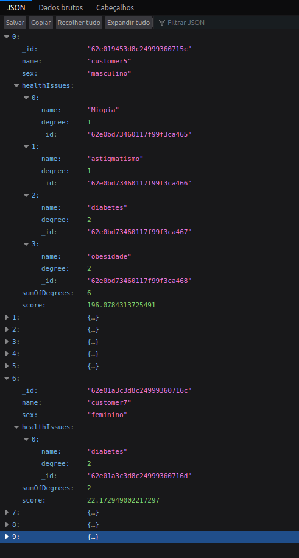

# Backend Developer Challenge

Para este desafio eu utilizei:

- Node.js
- Express.js
- MongoDB
- Mongoose
- Jest
- Supertest

### Endpoint dos 10 clientes com maior risco de saúde



### Testes


## Instruções para rodar o app localmente:

1. Inicie o MongoDB

```bash
mongod
```

2. Instale as dependências:
```bash
npm install
```

3. Execute o app:
```bash
npm start
```
## Instruções para executar os testes:

```bash
npm test
```
